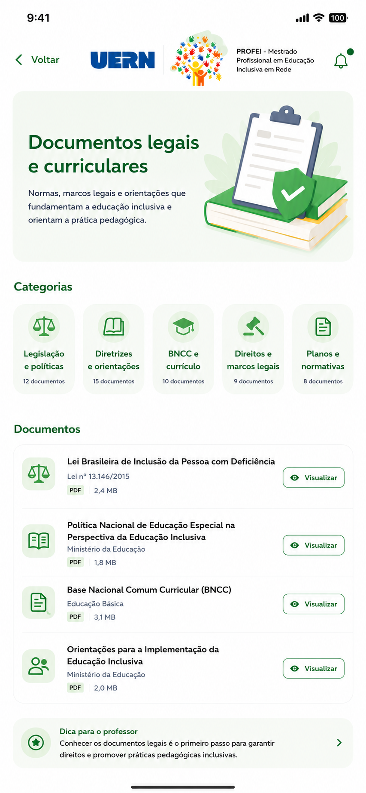
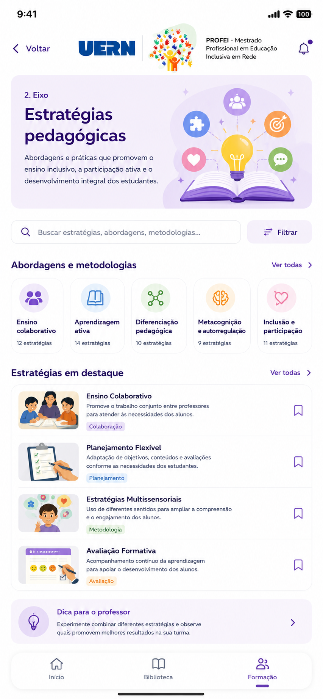
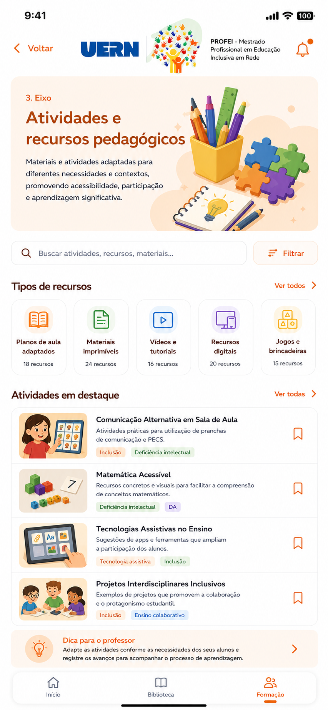

# EduBase

Aplicativo web mobile-first para acesso a documentos, estratégias e recursos pedagógicos voltados à **educação inclusiva**, desenvolvido para o programa **PROFEI/UERN**.

## Capturas de Tela

| Home | Eixo | Biblioteca | Cadastro |
|------|------|------------|----------|
|  |  |  |  |

## Tecnologias

- HTML5, CSS3, JavaScript ES6+ (vanilla, sem frameworks)
- Supabase (banco de dados + backend)
- GitHub Pages (hospedagem)
- IndexedDB (armazenamento local de favoritos e notificações removidas)
- localStorage (persistência da Dica do Dia)
- Fonte Inter (Google Fonts)

## Funcionalidades

### 1. Home (`#/`)

- Header com logotipo EduBase e ícone de notificações (sino)
- Hero section com título, descrição, ilustração CSS e botão **"Começar agora"** (redireciona para a Biblioteca)
- Card **"Nosso objetivo"** com a missão do EduBase
- Seção **"Eixos do EduBase"** com 3 cards clicáveis (verde, roxo, laranja) — cada um navega para o eixo correspondente
- Link "Ver todos" para a Biblioteca
- **Dica do Dia** — rotação automática de 21 frases sobre educação inclusiva

#### Dica do Dia — Detalhes

O card "Dica do Dia" funciona com as seguintes regras:

| Regra | Descrição |
|-------|-----------|
| **Seleção aleatória** | Uma das 21 frases é sorteada a cada ciclo |
| **Rotação automática** | Nova dica a cada 5 minutos (atualização em tempo real) |
| **Persistência** | Mantém mesma dica ao recarregar a página (usando `localStorage`) |
| **Timestamp** | Cada dica salva com horário para controle de expiração |

Frases incluem temas como:
- Legislação e documentos legais
- Adaptação curricular
- Recursos multissensoriais
- Avaliações inclusivas
- Comunicação alternativa e aumentativa
- Tecnologias assistivas
- Formação continuada do professor
- Autonomia dos alunos
- Acessibilidade física e pedagógica
- E mais...

### 2. Eixos Temáticos (`#/eixo/:id`)

Cada eixo possui tema de cores próprio:

| Eixo | Tema | Cor |
|------|------|-----|
| Eixo 1 | Documentos legais e curriculares | Verde (`#1B5E4B`) |
| Eixo 2 | Estratégias pedagógicas | Roxo (`#624693`) |
| Eixo 3 | Atividades e recursos pedagógicos | Laranja (`#E8752A`) |

Dentro de cada eixo:
- **Header** com botão "Voltar" e logotipo
- **Hero** com nome, descrição e emoji representativo do eixo
- **Barra de busca textual** com filtro em tempo real (filtra por título, descrição e autor/origem)
- **Carrossel de categorias** — scroll horizontal com CSS snap; clique numa categoria filtra os documentos
- **Botão "Filtrar"** — abre um modal sheet (bottom sheet) com a lista de categorias do eixo para seleção
- **Lista de documentos** com cards padronizados contendo:
  - Thumbnail emoji
  - Título e descrição (com clamp de 2 linhas)
  - Tags categorizadas com cores
  - Botão **Visualizar** (ícone olho) — abre URL em nova aba
  - Botão **Bookmark** (ícone marcador) — adiciona/remove dos favoritos no IndexedDB
- Contador de resultados ("X documento(s) encontrado(s)")
- Tema de cores aplicado dinamicamente via CSS variables (`theme-green`, `theme-purple`, `theme-orange`)

### 3. Biblioteca (`#/biblioteca`)

- **Busca textual global** — filtra por título, descrição e autor/origem
- **Filtros por eixo** via chips clicáveis (Todos, Eixo 1, Eixo 2, Eixo 3)
- **Lista completa** de todos os documentos de todos os eixos
- Cada card mantém o tema de cores do seu respectivo eixo
- Estado de bookmark verificado em tempo real contra o IndexedDB
- Contador de resultados atualizado em tempo real

### 4. Favoritos (`#/favoritos`)

- Lista de documentos marcados como bookmark (armazenados no IndexedDB)
- Ordenados do mais recente para o mais antigo (por `saved_at`)
- Contador de documentos salvos
- Cada card mantém tema de cores e botões de visualizar/bookmark
- **Estado vazio** com ícone, instruções de uso e dica de como salvar documentos

### 5. Cadastrar (`#/cadastrar`)

- Formulário completo de cadastro de documentos
- Campos obrigatórios: Título, Descrição, URL, Tipo (PDF/site), Autor/Origem, Eixo, Categoria, Ícone
- Campos opcionais: Tags (multi-seleção)
- **Seletor de Eixo** — 3 cards clicáveis (verde, roxo, laranja)
- **Seletor de Categoria** — filtrado dinamicamente conforme o eixo selecionado
- **Grid de Ícones** — 29 ícones SVG para seleção (scrollável, seleção única)
- **Chips de Tags** — toggleável (multi-seleção)
- Validação de campos obrigatórios
- Após cadastro: mensagem de sucesso com opções "Ver na Biblioteca" ou "Cadastrar outro"
- Persiste no modo mock (IndexedDB) ou Supabase

### 6. Notificações (Sino no Header)

- Painel overlay acessado pelo ícone de sino no canto superior direito
- Exibe os **últimos 15 documentos** cadastrados (excluindo notificações removidas)
- Cada item com:
  - Thumbnail emoji com cor do eixo
  - Título e trecho da descrição (truncado em 60 caracteres)
  - Botão **Visualizar** (abre documento)
  - Botão **Remover** (exclui a notificação com animação)
- Fechamento por:
  - Clique no fundo escuro (overlay)
  - Botão "X" no header do painel
  - Swipe para a esquerda em dispositivos touch (gesto com threshold de 80px)
- Animação de slide-down ao abrir e slide-out ao remover item
- Estado vazio: "Todas as notificações foram visualizadas"
- **Persistência**: notificações removidas são salvas no IndexedDB (`notificacoes_removidas`) para não reaparecerem

### 7. Navegação

- **Bottom navigation** fixa com 4 itens: Início, Biblioteca, Favoritos, Cadastrar
- Indicador visual de rota ativa (barra colorida + cor do tema)
- Roteamento por hash (`#/`, `#/eixo/:id`, `#/biblioteca`, `#/favoritos`, `#/cadastrar`)
- Navegação para rotas inválidas redireciona para Home

### 8. Interações e Animações

- **Loading spinner** com animação de rotação
- **Transições de tela** com fade-in e slide-up
- **Skeleton loading** preparado (CSS classes `skeleton`, `skeleton-card`, `skeleton-hero`, `skeleton-categoria`)
- **Hover effects** nos cards (translateY + shadow)
- **Modal sheet** com animação slide-up e overlay
- **Painel de notificações** com animação slide-down
- **Swipe-to-dismiss** em notificações (touch)
- **Safe area inset** para dispositivos com notch/barra inferior

### 9. Design Responsivo

- Layout mobile-first com `max-width: 430px`
- Em telas maiores, o app é centralizado com sombra lateral
- CSS variables para temas dinâmicos (verde/roxo/laranja)
- Scroll horizontal com snap para carrossel de categorias
- `user-scalable=no` no viewport para experiência nativa

## Banco de Dados (Supabase)

### Estrutura das Tabelas

| Tabela | Colunas | Descrição |
|--------|---------|-----------|
| **eixos** | id, nome, descricao, ordem, cor, icone, dica, created_at | 3 eixos temáticos |
| **categorias** | id, eixoid (FK), nome, descricao, icone, ordem, totaldocumentos, created_at | 15 categorias (5 por eixo) |
| **tags** | id, nome (UNIQUE), cor, created_at | 10 tags (PDF, Colaboração, Metodologia, etc.) |
| **icone** | id, nome (UNIQUE), descricao, created_at | 29 ícones SVG do aplicativo |
| **documentos** | id, titulo, descricao, url, tipo, autor_origem, iconeid (FK), eixoid (FK), categoriaid (FK), datacadastro, ativo | Documentos cadastrados |
| **documento_tags** | documentoid (FK), tagid (FK) | Relação N:N documento-tag |

### Funcionalidades do BD

- **Trigger** `trg_atualizar_total_documentos` — mantém `totaldocumentos` nas categorias sincronizado automaticamente (INSERT, UPDATE, DELETE)
- **View** `documentos_completo` — JOIN completo de documentos com categorias, eixos, ícones e tags agregadas em JSON
- **Row Level Security (RLS)** — leitura pública em todas as tabelas; inserção para anon/authenticated
- **Índices** nas foreign keys para performance (`idx_categorias_eixoid`, `idx_documentos_categoriaid`, `idx_documentos_eixoid`, `idx_documentos_iconeid`, `idx_documentos_ativo`, `idx_documento_tags_doc`, `idx_documento_tags_tag`)
- **Seed data** — inserção automática dos 3 eixos, 15 categorias, 10 tags, 29 ícones, 12 documentos e relações documento-tags

## Armazenamento Local

### IndexedDB

- **Banco**: `edubase` (versão 2)
- **Store `bookmarks`**: armazena documentos salvos com `docId` como keyPath e índice `saved_at`
  - Operações: `addBookmark`, `removeBookmark`, `getAllBookmarks`, `isBookmarked`
  - Dados salvos: docId, titulo, descricao, url, tipo, autor_origem, tags, eixoid, saved_at
- **Store `notificacoes_removidas`**: armazena IDs de notificações descartadas
  - Operações: `addRemovida`, `isRemovida`, `getTodasRemovidas`
  - Evita que notificações removidas reapareçam ao reabrir o painel
- Persiste entre sessões sem necessidade de login

### localStorage

- **Chave `edubase_dica_atual`**: armazena a dica do dia atual com timestamp
  - Formato: `{ texto: string, timestamp: number }`
  - Usado para persistir a dica entre recarregamentos da página
  - Expira após 5 minutos (nova dica é sorteada automaticamente)

## Arquitetura

### `js/app.js`
Núcleo do aplicativo:
- Roteamento hash (`#/`, `#/eixo/:id`, `#/biblioteca`, `#/favoritos`, `#/cadastrar`)
- Inicialização do Supabase/API e Views
- Atualização da nav bar conforme rota ativa
- Listener global para ação de bookmark (toggle)
- `getDocById()` para busca de documento por ID no mock data

### `js/views.js`
Engine de renderização — maior arquivo do projeto:
- `renderHome()` — tela inicial com hero, objetivo, eixos e dica
- `renderEixo(eixoId)` — tela do eixo com hero, busca, carrossel, filtros e lista de documentos
- `renderEixoWithFilter()` — re-renderiza apenas a lista de documentos ao buscar/filtrar
- `renderBiblioteca()` — listagem global com busca e chips de filtro por eixo
- `renderBibliotecaWithFilter()` — re-renderiza lista ao buscar/filtrar
- `renderFavoritos()` — lista de bookmarks com estado vazio
- `renderCadastro()` — formulário completo de cadastro com seletores de eixo, categoria, ícone e tags
- `abrirNotificacoes()` — painel overlay com notificações, remoção e swipe-to-dismiss
- `getDicaAtual()` — gerencia rotação da dica do dia com persistência em localStorage
- `getRandomDica()` — seleciona frase aleatória do array `DICAS_EDUCACAO`
- Funções auxiliares: `renderHeader`, `renderDocCard`, `renderSearchBar`, `renderCategoriasScroll`, `renderModalFiltro`, `renderDica`, etc.

### `js/api.js`
Camada de dados:
- Abstrai chamadas ao Supabase com fallback para modo mock
- `getEixos()` / `getEixo(id)` — busca de eixos
- `getCategorias(eixoId)` — categorias de um eixo
- `getTags()` — todas as tags disponíveis
- `getIcones()` — todos os ícones disponíveis
- `getDocumentos({ eixoId, categoriaId, busca })` — documentos com filtros combináveis
- `getDocumentosRecentes(limite)` — últimos documentos cadastrados
- `createDocumento(doc)` — insere novo documento
- `addDocumentoTag(docId, tagId)` — insere relação N:N documento-tag

### `js/store.js`
Camada de persistência local (IndexedDB):
- Abstrai operações de leitura/escrita no IndexedDB
- Gerencia duas stores: `bookmarks` e `notificacoes_removidas`

### `js/icons.js`
- 29 ícones SVG inline (feather icons)
- `ICON_DESCRIPTIONS` — mapa de descrições legíveis para cada ícone
- `ICON_LIST` — array de ícones para iteração no formulário de cadastro
- `EIXO_THEMES` — mapeamento de temas por eixo (class, emoji, label, catTitle, docTitle, layout)
- `DOC_THUMBS` — array de 10 emojis para thumbnails de documentos
- Função `getDocThumb(index)` — retorna emoji cíclico

### `js/data.js`
Dados mock de demonstração (`MOCK_DATA`):
- 3 eixos com nome, descrição, cor, ícone e dica
- 15 categorias distribuídas nos 3 eixos
- 10 tags com nome e cor
- 29 ícones com nome e descrição
- 12 documentos com título, descrição, URL, tipo, tags, iconeid, etc.
- **`DICAS_EDUCACAO`** — array com 21 frases sobre educação inclusiva para rotação da Dica do Dia

### `supabase/schema.sql`
Schema completo do banco de dados para execução no SQL Editor do Supabase:
- DDL (tabelas, índices, triggers, funções, views)
- Dados iniciais (seed)
- Configuração RLS e permissões

## Fluxo de Dados

```
Usuário → app.js (rota) → views.js (render) → api.js (dados)
                                                     ├── Supabase (se configurado)
                                                     └── MOCK_DATA (fallback local)
                              → store.js (IndexedDB) → bookmarks
                                                      → notificacoes_removidas
                              → localStorage → dica atual (com timestamp)
```

## Como Configurar o Supabase

1. Crie um projeto no [Supabase](https://supabase.com)
2. Execute o conteúdo de `supabase/schema.sql` no SQL Editor
3. Copie `js/config.example.js` para `js/config.js`
4. Preencha `url` e `anonKey` com as credenciais do seu projeto

Se `config.js` estiver vazio, o app funciona em modo demonstração com dados mock.

## Hospedagem

O app foi projetado para GitHub Pages:
- O arquivo `404.html` garante o funcionamento do hash routing
- Push na branch principal → GitHub Pages faz o deploy automaticamente

## Estrutura de Arquivos

```
├── index.html                # Shell do aplicativo
├── 404.html                  # Redirecionamento GitHub Pages
├── PLANO.md                  # Plano de implementação
├── README.md                 # Este arquivo
├── prompt.md                 # Prompt de desenvolvimento
├── css/
│   └── styles.css            # Todos os estilos
├── js/
│   ├── app.js                # Roteamento e inicialização
│   ├── views.js              # Renderização das telas
│   ├── api.js                # Camada de dados Supabase/mock
│   ├── store.js              # IndexedDB para favoritos e notificações
│   ├── icons.js              # 29 ícones SVG e temas dos eixos
│   ├── data.js               # Dados mock e array DICAS_EDUCACAO
│   ├── config.js             # Configuração Supabase (preencher)
│   └── config.example.js     # Template de configuração
├── supabase/
│   └── schema.sql            # Schema completo do banco de dados
├── 1EduBase-PROFEI-Priscila.png  # Captura de tela - Home
├── 2EduBase-PROFEI-Priscila.png  # Captura de tela - Eixo
├── 3EduBase-PROFEI-Priscila.png  # Captura de tela - Biblioteca
└── 4EduBase-PROFEI-Priscila.png  # Captura de tela - Cadastro
```
